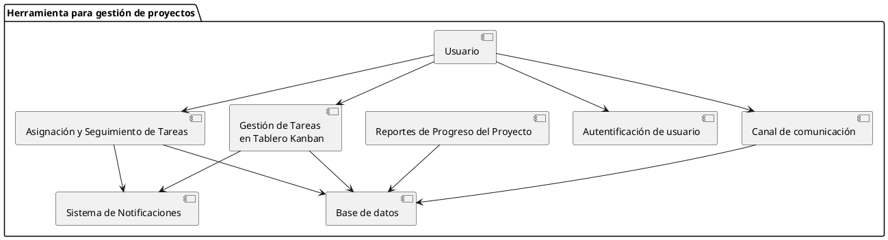
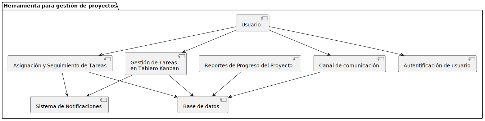

# Diagrama de Componentes

Para representar la arquitectura del proyecto de forma básica, en este archivo se presenta el código fuente de del diagrama de componentes:

Dicho diagrama se visualiza a continuación:

