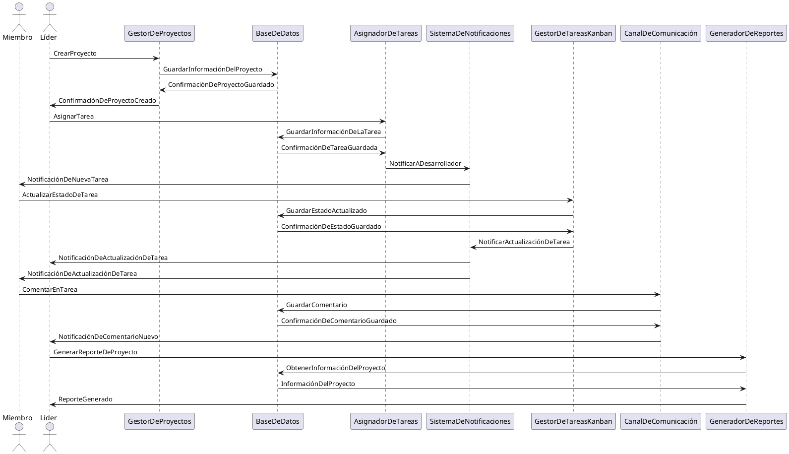
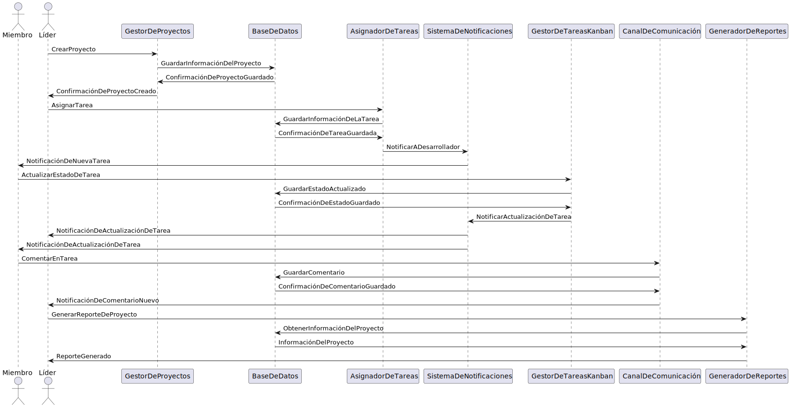

# Diagrama de Secuencia

Para representar las interacciones entre los objetos del proyecto, en este archivo se presenta el código fuente de del diagrama de secuencia:

Dicho diagrama se visualiza a continuación:

